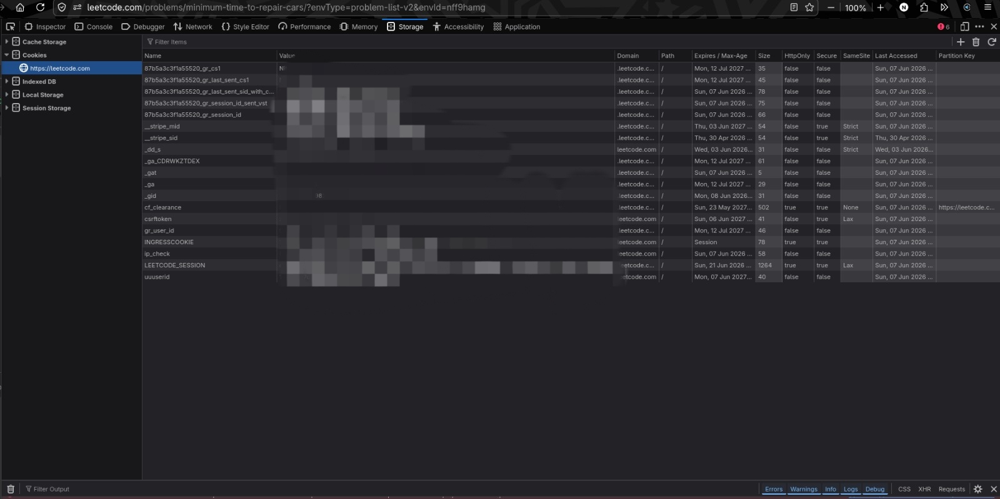
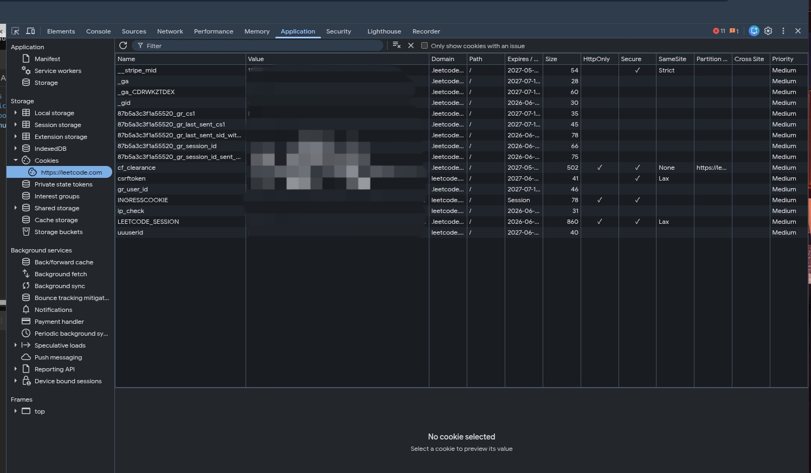

# LeetCode Solution Downloader & Sync Tool

A robust Python automation tool designed to scrape, organize, and incrementally synchronize all your accepted LeetCode solutions to a local folder. 

---

## 📂 File Structure & Purposes

Here is an overview of the files included in this repository and their purposes:

| File | Purpose |
| :--- | :--- |
| **`sync_leetcode.py`** | The main executable Python script. It queries LeetCode's GraphQL API to fetch your submission history, filters for accepted status, maps LeetCode language names to correct file extensions (e.g. C++ ➜ `.cpp`, Python3 ➜ `.py`), and saves them locally. |
| **`.env`** | *Local configuration file (user-created/auto-migrated)*. Stores LeetCode session cookies (`LEETCODE_SESSION`, `LEETCODE_CSRF_TOKEN`), custom delays, custom domains, and the last synced state timestamp (`LEETCODE_LAST_SYNCED_TIMESTAMP`). |
| **`.env.example`** | A template configuration file containing dummy variables to guide the setup of your local `.env` file. |
| **`.gitignore`** | Instructs Git to ignore sensitive information (like credentials in `.env`), runtime cache directories (`__pycache__/`), and old backup files, keeping your repository secure and clean. |
| **`state.json.bak`** | A backup of the legacy sync state file (`state.json`), preserved safely after migrating sync states directly to `.env`. |

> [!NOTE]
> The folder **`LeetCode_Solutions/`** (created automatically upon running the script) is excluded from this list. It contains your downloaded solutions organized under descriptive subdirectories for each LeetCode problem.

---

## ✨ Features

- **Dedicated Folder Structure**: Automatically generates structured folders for each solved problem: `LeetCode_Solutions/<problem_number>.<problem_title>/solution.<ext>`.
- **Incremental Syncing**: Saves synchronization state directly to `.env` as `LEETCODE_LAST_SYNCED_TIMESTAMP`. Subsequent runs only retrieve and download solutions submitted *after* the last successful check.
- **Language Support**: Automatically maps LeetCode languages to correct file extensions (Python, C++, Java, JS/TS, Go, Rust, SQL, Bash, etc.).
- **Rate-Limit Safe**: Integrates configurable request delays to respect LeetCode's rate limits and prevent Cloudflare/IP blocking.
- **Interrupt & Resume**: Chronological processing guarantees that if the script is interrupted, it can resume from the exact point of interruption without losing progress or duplicating work.

---

## 🚀 Installation & Setup

### 1. Requirements
The script uses the standard `requests` library. Ensure you run it with your local Python virtual environment (e.g., located at `~/Env/venv`).

### 2. Retrieve LeetCode Cookies
Since LeetCode submission data is private, you must authenticate using your browser's session cookies.
1. Open your browser and log in to [LeetCode](https://leetcode.com).
2. Open **Developer Tools** (Press `F12` or `Ctrl + Shift + I` / `Cmd + Option + I`).
3. Locate the cookie values depending on your browser:
   - **Firefox**: Select the **Storage** tab, expand **Cookies**, and select `https://leetcode.com`.
     <br><br>
     
     <br><br>
   - **Chrome / Edge / Brave / Opera**: Select the **Application** tab, expand **Cookies** under the Storage section, and select `https://leetcode.com`.
     <br><br>
     
     <br><br>
4. In the cookie table, locate the following keys and copy their corresponding **Value**:
   - `LEETCODE_SESSION`
   - `csrftoken`

### 3. Configuration
1. Rename/copy `.env.example` to `.env` in the root directory:
   ```bash
   cp .env.example .env
   ```
2. Open `.env` and fill in the values:
   ```env
   LEETCODE_SESSION=your_leetcode_session_here
   LEETCODE_CSRF_TOKEN=your_csrftoken_here
   ```

*(Note: If you run the script with a legacy `config.json` or `state.json` present in the repository, the script will automatically migrate your settings and sync progress to `.env` and create backup files).*

---

## 💻 Usage

Run the script using the virtual environment python interpreter:

```bash
~/Env/venv/bin/python sync_leetcode.py
```

### Command Line Arguments

- **Reset state** (Download everything from scratch):
  ```bash
  ~/Env/venv/bin/python sync_leetcode.py --reset
  ```
- **Custom environment configuration file path**:
  ```bash
  ~/Env/venv/bin/python sync_leetcode.py --env /path/to/.env
  ```
- **Change request delay** (e.g., set to 2.5 seconds):
  ```bash
  ~/Env/venv/bin/python sync_leetcode.py --delay 2.5
  ```
